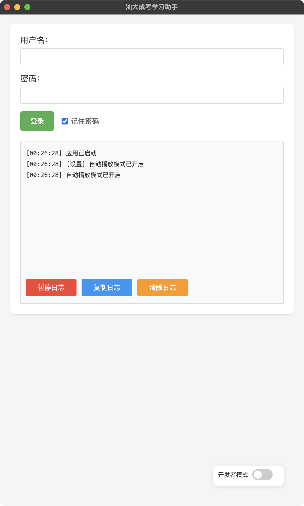
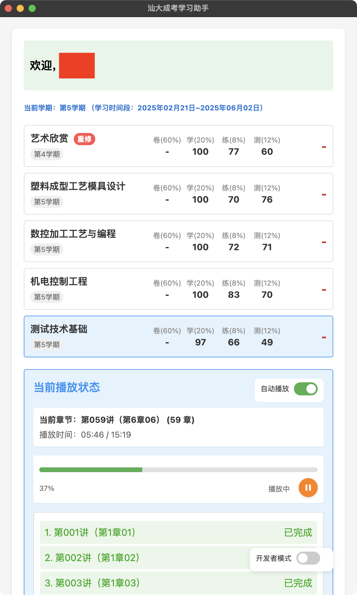
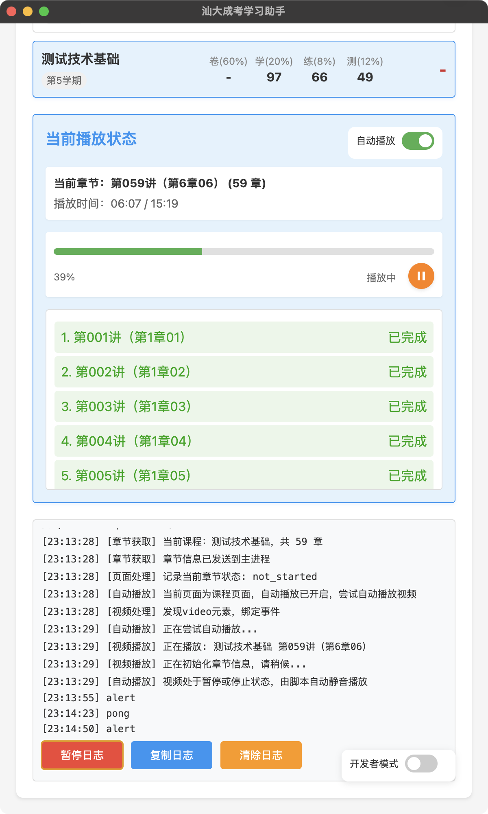

# 汕大成考学习助手

本项目是一个基于 Electron 的汕头大学继续教育学院在线学习自动化辅助工具，支持课程列表展示、自动播放等功能。

## 功能特色

- 自动登录与记住密码
- 课程列表与成绩展示
- 自动播放课程视频
- 章节进度追踪
- 日志记录与导出
- 支持开发者模式

## 截图预览

### 登录界面



### 主界面



### 播放状态与章节进度




## 使用方法

1. 安装依赖

   ```bash
   npm install
   ```

2. 启动应用

   ```bash
   npm start
   ```

3. 打包应用

   ```bash
   npm run dist
   ```

## 依赖环境

- Node.js
- Electron

## 免责声明

本项目仅供学习与交流使用，请勿用于任何商业用途。
本项目全部由 Cursor 生成（包括此说明），一切责任与本人无关。
本项目不提供编译后的版本，有需求自行编译使用。
